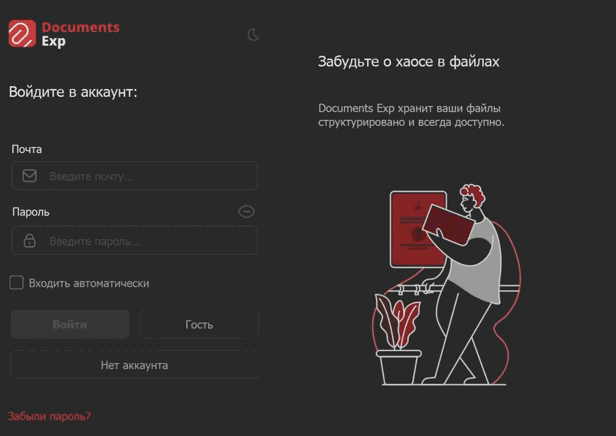
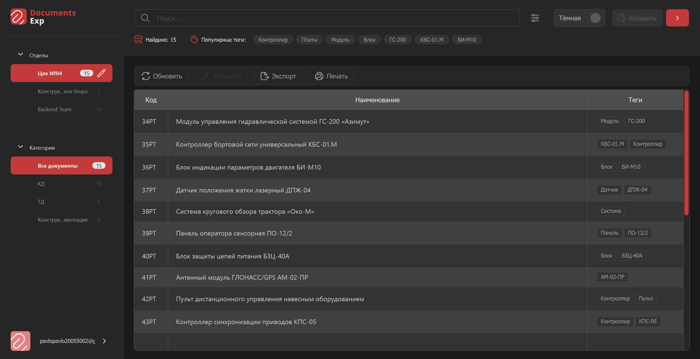
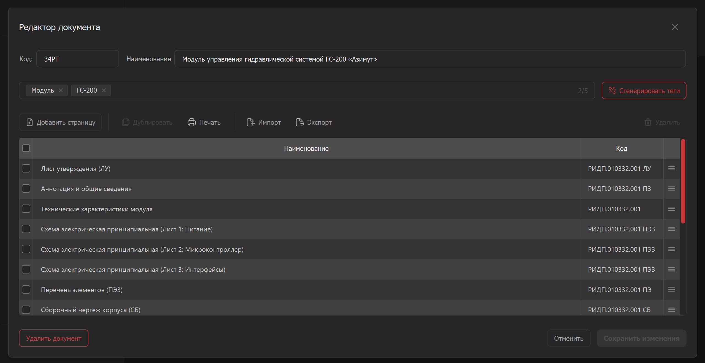
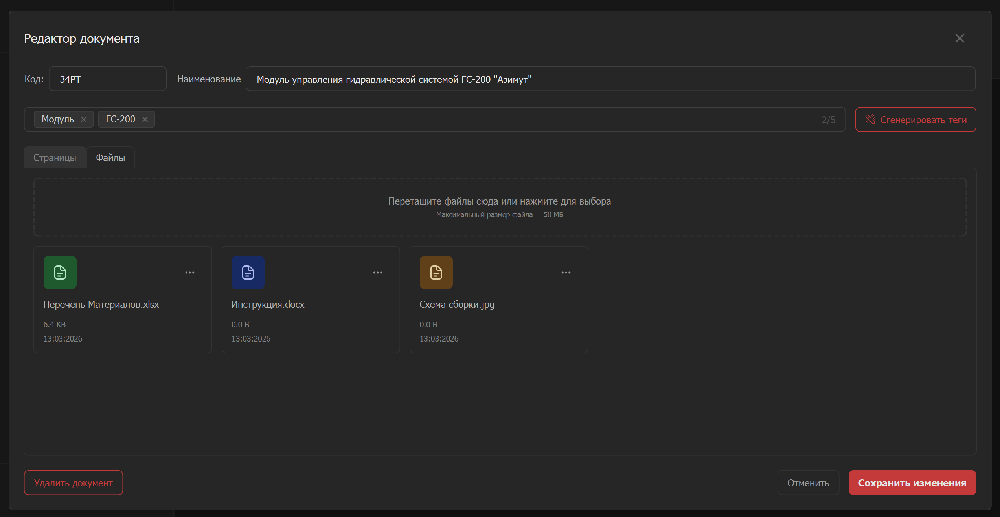

# Documents Exp

> English version available: [README.md](README.md)


Настольное клиентское приложение для поиска, хранения и управления документацией предприятия. Приложение построено на Python и PyQt5, использует архитектуру MVC и взаимодействует с удаленным REST API.

---

## 🖼 Скриншоты

### Авторизация

Безопасный вход в систему с возможностью авто-входа. Поддержка режима "Гость" для просмотра.



### Главное окно

Отображение иерархии Отделов и Категорий. Таблица документов с бесконечной прокруткой и поиском.



### Редактор документов

Позволяет авторизованным пользователям создавать, редактировать и управлять страницами документа. Поддержка добавления и работы с электронными файлами документа. Поддержка Drag-and-Drop.




---

## 🛠 Что нового (v0.2.17)

- Повышена общая стабильность сессий, настроек, уведомлений и обновлений.
- Добавлена более безопасная обработка дубликатов файлов и неполных данных сессии в edge-case сценариях.
- Снижен риск сбоев интерфейса при частых действиях (уведомления, переключение темы, запуск установщика обновления).

---

## 💡 Что нового (v0.2.0) - Профиль и Настройки

Это обновление добавляет персонализацию и удобство использования.

### 👤 Редактирование профиля

- **Персональные данные:** Теперь вы можете изменять свои данные (Имя, Фамилия, Отдел) прямо в приложении.
- **Доступ:** Диалог профиля доступен из главного меню приложения.

### ⚙️ Сохранение настроек

- **Персонализация:** Приложение теперь запоминает ваши предпочтения для каждого пользователя.
- **Тема:** Выбранная тема (светлая/тёмная) сохраняется между сессиями.
- **Фильтры:** Последние использованные фильтры поиска также сохраняются, ускоряя повторный поиск.

### ⚡ Также в этом обновлении

- Добавлено отдельное окно "Что нового", которое открывается после обновления и показывает список изменений версии.
- Улучшения интерфейса и исправления ошибок для более стабильной работы.
- Улучшена стабильность сессии после простоя: список документов и результаты поиска больше не исчезают, если запрос обновления или поиска завершился ошибкой.
- Начальная загрузка главного окна перенесена из UI-потока в фоновый, чтобы уменьшить подвисания при первом получении данных.
- Сценарии авторизации теперь корректно завершаются ошибкой, если системное хранилище ключей или сессии недоступно.
- API-клиент теперь корректно обрабатывает успешные пустые ответы, например `204 No Content`.
- При выходе из аккаунта теперь явно отключается auto-login для текущего профиля.

---

## 📌 Обзор

**Documents Exp** разработано для оптимизации управления технической документацией в организации. Приложение предоставляет структурированное представление документов по отделам и категориям, а также обеспечивает эффективный поиск и редактирование.

Приложение обеспечивает целостность данных за счет взаимодействия с центральным REST API и поддерживает различные уровни доступа для гостей и авторизованных сотрудников.

---

## 🎯 Ключевые возможности

### ✅ Управление документами

- **Иерархия:** Организация по **Отделам** и **Категориям**.
- **Навигация:** Боковая панель с счетчиками документов.
- **Поиск:** Мгновенный поиск по шифру или наименованию с задержкой ввода (debounce).
- **Сортировка:** "Естественная сортировка" для правильного отображения кодов.
- **Пагинация:** Бесконечная прокрутка для больших списков.

### ✅ Два режима доступа

#### 🔐 Режим Пользователя

- Полный доступ: **Создание**, **Редактирование**, **Удаление**.
- Управление структурой (Отделы/Категории).
- Функции Импорта/Экспорта.

#### 👤 Режим Гостя

- Доступ только для чтения.
- Поиск и просмотр документов.
- Без прав редактирования.

### ✅ Редактор документов

- **Управление страницами:** Добавление, Дублирование, Удаление.
- **Drag-and-Drop:** Изменение порядка страниц перетаскиванием.
- **Интеграция с Word:**
    - **Импорт:** Парсинг страниц напрямую из таблиц `.docx`.
    - **Экспорт:** Генерация форматированных `.docx` файлов.
- **Печать:** Встроенная функция печати.

### ✅ Безопасность и Авторизация

- **JWT Аутентификация:** Access/Refresh токены.
- **Авто-вход:** Безопасное хранение сессии в системном **Keyring**.
- **Управление аккаунтом:** Регистрация, Подтверждение почты, Сброс пароля.

### ✅ Интерфейс (UI/UX)

- **Современный дизайн:** PyQt5 с кастомными виджетами.
- **Темы:** Динамические **Светлая** и **Тёмная** темы (генерация через Jinja2).
- **Адаптивность:** Корректное отображение на разных размерах окна.
- **Уведомления:** Всплывающие Toast-уведомления.

---

## 🧩 Для кого это?

✅ **Инженерные отделы**: Для хранения тех. спецификаций и чертежей.  
✅ **Предприятия**: Для ведения централизованного архива документации.  
✅ **Менеджеры**: Для организации рабочего процесса и структуры документов.

---

## 🧠 Что демонстрирует этот проект

✅ **Архитектура MVC**: Строгое разделение логики и интерфейса.  
✅ **Владение PyQt5**: Кастомные виджеты, сигналы/слоты, фильтры событий, анимации.  
✅ **Асинхронность**: Неблокирующий UI с использованием `QThread` для API запросов.  
✅ **REST API Интеграция**: Надежный HTTP клиент с управлением сессиями и ошибками.  
✅ **Безопасность**: Защищенное хранение токенов.  
✅ **Динамическая темизация**: Использование шаблонизатора Jinja2 для QSS.

---

## 🏗 Архитектура

Проект следует паттерну **MVC (Model-View-Controller)** для разделения логики и интерфейса.

```
┌──────┐     ┌────────────┐     ┌───────┐
│ View │ <-- │ Controller │ --> │ Model │
└──────┘     └────────────┘     └───────┘
  UI           Логика           Данные/API
```

- **View (Представление):** Отвечает за отрисовку UI и события пользователя.
- **Controller (Контроллер):** Управляет логикой, обрабатывает сигналы и связывает View и Model.
- **Model (Модель):** Управляет данными, общением с API и бизнес-логикой.

---

## 🛠 Технологический стек

- **Язык:** Python 3.14
- **GUI Фреймворк:** PyQt5
- **API Клиент:** Requests (с поддержкой сессий)
- **Безопасность:** Keyring (хранение токенов)
- **Темизация:** Jinja2 (генерация QSS)
- **Работа с документами:** python-docx

---

## 🔧 Установка

1. Скачайте последний установщик (`.exe`) со страницы релизов (Releases).

2. Запустите установщик и следуйте инструкциям.

3. Настройка:
   Перейдите в папку установки (обычно `%LOCALAPPDATA%\Programs\Documents Exp`).
   Отредактируйте `config.yaml`, указав URL вашего API:

    ```yaml
    base_url: "http://127.0.0.1:8000"
    ```

4. Запустите приложение, используя ярлык на рабочем столе или в меню "Пуск".

---

## 📦 Компиляция

Для сборки приложения в исполняемый файл (EXE):

1. Установите PyInstaller:

    ```bash
    pip install pyinstaller
    ```

2. Запустите сборку, используя готовый spec-файл:

    ```bash
    pyinstaller "Documents Exp.spec"
    ```

3. Скомпилированное приложение будет находиться в папке `dist/Documents Exp`.

---

## � Структура проекта

```
DOCUMENTS-EXP-DESKTOP/
│ app.py
│ config.yaml
│ requirements.txt
│ README.md
│
├─ api/
│ └─ api_client.py
│
├─ core/
│ └─ worker.py
│
├─ modules/
│ ├─ auth/
│ ├─ main/
│ ├─ document_editor/
│ ├─ departments_editings/
│ └─ categories_editings/
│
├─ resources/
│ ├─ icons/
│ ├─ logo/
│ ├─ slides/
│ └─ templates/
│
├─ ui/
│ ├─ custom_widgets/
│ ├─ styles/
│ └─ ui_converted/
│
└─ utils/
  ├─ notifications/
  └─ ...
```

---

## 🔒 Модель безопасности

✅ JWT Аутентификация  
✅ Безопасное хранение токенов (Keyring)  
✅ Пароли не хранятся в открытом виде  
✅ Управление сессиями  
✅ Безопасно для внутреннего использования

---

## 🚦 Статус проекта

✅ Активен  
✅ В активной разработке  
✅ Планируются новые функции  
✅ Регулярные обновления

---

## 📜 Лицензия

MIT License

Copyright (c) 2025 Pavel (PN Tech)

Permission is hereby granted, free of charge, to any person obtaining a copy
of this software and associated documentation files (the "Software"), to deal
in the Software without restriction, including without limitation the rights
to use, copy, modify, merge, publish, distribute, sublicense, and/or sell
copies of the Software, and to permit persons to whom the Software is
furnished to do so, subject to the following conditions:

The above copyright notice and this permission notice shall be included in all
copies or substantial portions of the Software.

THE SOFTWARE IS PROVIDED "AS IS", WITHOUT WARRANTY OF ANY KIND, EXPRESS OR
IMPLIED, INCLUDING BUT NOT LIMITED TO THE WARRANTIES OF MERCHANTABILITY,
FITNESS FOR A PARTICULAR PURPOSE AND NONINFRINGEMENT. IN NO EVENT SHALL THE
AUTHORS OR COPYRIGHT HOLDERS BE LIABLE FOR ANY CLAIM, DAMAGES OR OTHER
LIABILITY, WHETHER IN AN ACTION OF CONTRACT, TORT OR OTHERWISE, ARISING FROM,
OUT OF OR IN CONNECTION WITH THE SOFTWARE OR THE USE OR OTHER DEALINGS IN THE
SOFTWARE.

---

## 👤 Автор

**Pavel (PN Tech)**
Python desktop and web developer, UI/UX designer, electronics engineer
